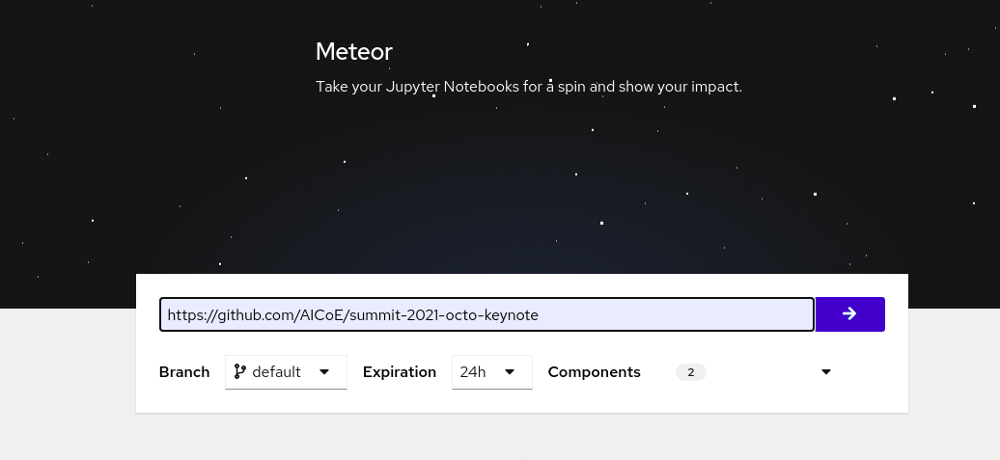
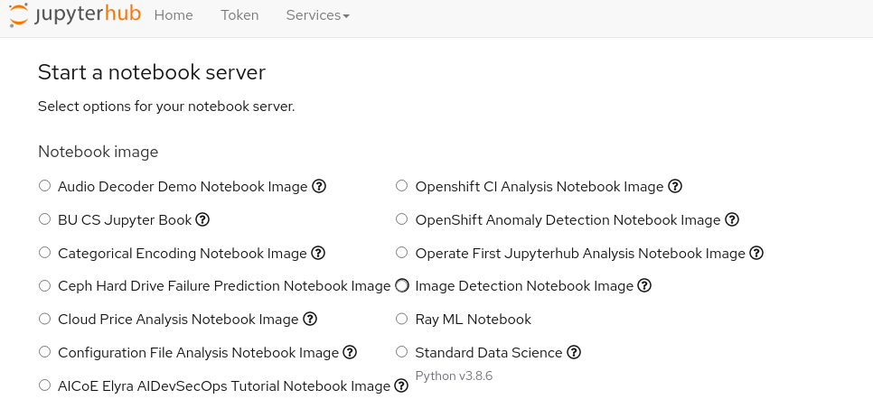
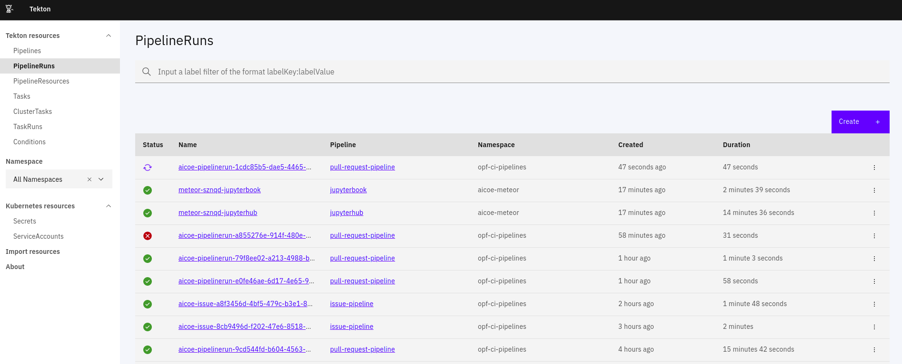
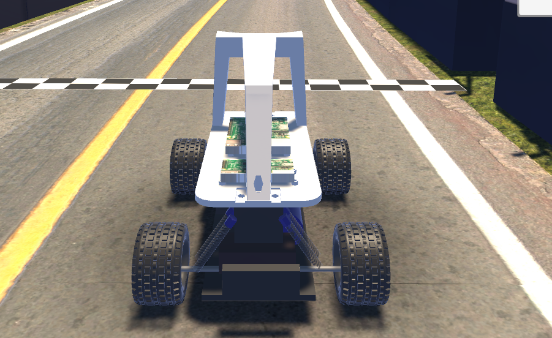

# ML @ THE EDGE!

In this demo we will walk through what it takes to manage a machine learning application's lifecycle on an edge device using a few projects developed by Red Hat's Emerging Technologies group. Specifically, we will use [Open Data Hub](https://opendatahub.io/), [Microshift](https://github.com/redhat-et/microshift) and [Meteor](https://shower.meteor.zone/) along with a couple other open source projects running on the [Operate First community cloud](https://www.operate-first.cloud/).

The goal of this project is to demonstrate the development, training and deployment of an intelligent application onto an edge device, an autonomous RV car, via the [Operate First community cloud](https://www.operate-first.cloud/).

## The Approach

For this demo we are going to target the autonomous RV car project [DonkeyCar](https://www.donkeycar.com/).


https://www.donkeycar.com/


The DonkeyCar project is, "An opensource DIY self driving platform for small scale cars. RC CAR  +  Raspberry Pi + Python (tornado, keras, tensorflow, opencv, ....)". This project has an active community, as well as open source code, data, and ml models that make it simple to develop this demo in an open source and evergreen fashion. Furthermore, the DonkeyCar project has also built a simulator, so anyone can try out the vast majority of this demo without the need for a physical car!


### Prerequisites

The infrastructure required for this demo has been (_mostly_) set up on the Operate First Community Cloud:

* DonkeyCar simulator
* Open Data Hub
* Meteor
* Tekton
* ArgoCD
* Minishift (on the physical car)


## The Development Environment

The first thing we do is spin up a data science development environment. This can be easily done by going to https://shower.meteor.zone/ and using the URL for this repo to build a jupyter lab images with all the development requirements installed based on our [Pipfile.lock](../Pipfile.lock).



Once the build is complete, we can then go ahead and spawn our custom notebook image in the Operate First Community Cloud Jupyter Hub Instance [here](https://jupyterhub-opf-jupyterhub.apps.smaug.na.operate-first.cloud/). The image should have the same name as the meteor.



## Train A Model

Now that we've spawned a Jupyter Lab environment, we're ready to start training a model for a self driving car! From this point, we can start to download some datasets, train models, and experiment with different machine learning model architectures!

Below you can find two example notebooks we've used to download some publicly available data and train a simple model:

* [Download Data Notebook](../apps/donkeycars/default_car/Download_Data.ipynb)
* [Training Notebook](../apps/donkeycars/default_car/simple_train.ipynb)

## Deploy the Model

Now that we have a trained self driving car model ready to go, let's deploy it to our car (or digital twin)!

This is done by simply making a Pull Request to our GitHub repository, getting our new model merged into the upstream repository, and then making a new tag release on the repo. The tag release will kick off the automated build pipeline through [Tekton](https://tekton.operate-first.cloud/#/pipelineruns) based on our [Digital Twin Dockerfile](../Dockerfile.donkey) and [RC Car Dockerfile](../Dockerfile.donkey.arm64), creating two new images, each with our new model and push them to [quay.io](https://quay.io/repository/aicoe/summit-2021-octo-keynote?tab=tags) along with [signed signatures](https://tekton.dev/docs/chains/signing/).

```bash
$ git tag <your release tag>
```


Once the images are built and pushed to quay, [ArgoCD](argocd.operate-first.cloud) takes over and deploys the new images on their respective devices, the [cosgined](https://github.com/sigstore/cosign) validator validates the signed signatures, ensure the images are the valid images and approves the deployment to [microshift]( https://microshift.io/) running on a RaspberryPi controlling the physical RC car and microshift running on a NUC controlling the digital twin.




And with that we have successfully developed and deployed a self-driving RC car model to the edge with the help of a couple projects developed by Red Hat's Emerging Technologies group!
